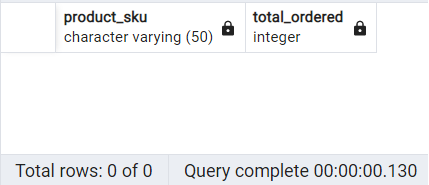

### What are your risk areas? Identify and describe them.

There are lots of records the only difference between them is unit_price. Because of a lack of data understanding I can not manage them.


### QA Process:
Describe your QA process and include the SQL queries used to execute it.

Following rules are considered:

1- Uppercase keywords
2- Aliases used for query clarity
3- Use of indentation
4- White spaces
5- Add useful comments
6- Writing small queries and combining them to generate final query


### 1-Issues Regarding csv Files Loading into Database

As I tried to import csv files to database using pgAdmin4 import menu ([these instructions](https://www.postgresqltutorial.com/postgresql-tutorial/import-csv-file-into-posgresql-table/)), I got there is some problems with file "all_sessions.csv" and data loading never completed by pgAdmin4.

So I had to write a script to manage table creation and csv file importing. By runnig the script, I found following problems:

1- The first problem was a very long value for pageTitle field just for one record (more than 500 bytes). By checking that, I found it was a mistake. So I edited that field and, Character Varying (100) was enough for all records.

2- Another problem was regarding fullVisitorId. At first look, it looks like "bigint" data type is proper for that. But I got there are some values grater than "bigint" limit. So I decided to Use Character Varying(50) instead of "bigint". Also, I used Character Varying(50) format for all fields defined as ID in csv files.

A sample of this code for creating table and importing csv file is shown here,  I wrote for "sales_by_sku":

```SQL
--Creating a table and importing csv to that table
DO $$
BEGIN

CREATE TABLE PUBLIC.sales_by_sku
(
product_sku      CHARACTER VARYING(50),
total_ordered    INTEGER
);

ALTER TABLE IF EXISTS PUBLIC.sales_by_sku
    OWNER to postgres;
	
COPY sales_by_sku(product_sku,total_ordered)
FROM 'D:\0-LHL Activities\W01\SQL-Project\SQL-Project Git\SQL-Project\1-Data-Original\sales_by_sku.csv'
DELIMITER ','
CSV HEADER;	

END; $$;
```

This method is so faster and more reliable for big csv files with many fields.

As a powerful tool, I used [Notepad++](https://notepad-plus-plus.org/downloads/) software to open, edit, and investigate csv files. Notepad++ supports text files up to 2GB.


### 2- Table sales_by_sku has only 2 columns and all records are presented in table sales_record. So we can ignore sales_by_sku in future process. Following query is written for validation.

Query:

```SQL
/* Comparing Tables */
SELECT product_sku,
       total_ordered
FROM sales_report

EXCEPT

SELECT product_sku,
       total_ordered 
FROM sales_by_sku
```
Result:




### 3- I checked there is no negative value for all numerical fields by using such following query.

Query:

```SQL
/* Max and Min of field */
SELECT  
		max(ordered_quantity),   
        min(ordered_quantity)
FROM products
```
Result:


### 4-I omitted the columns with more than %80 null values. Following query used to obtain number of null values. For 


Query:

```SQL
/* Count NOT Null values */
SELECT  
	   count(transaction_revenue)
FROM all_sessions
WHERE transaction_revenue is not Null
```
Result:


Only 4 out of 15134 records are not null


