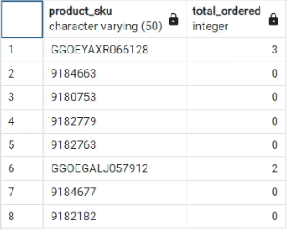

## What issues will you address by cleaning the data?

1- Comparing files sales_by_sku.csv and sales_report.csv shows all information mentioned in sales_by_sku.csv is already in sales_report.csv. Using following query shows there are a few records in sales_by_sku.csv, but their product_sku is never used in other csv files. So sales_by_sku.csv is not useful and I delete this table from database. 

```SQL
-- Comparing sales_by_sku.csv and sales_report.csv
SELECT 
      product_sku ,
      total_ordered 
FROM sales_by_skuv

EXCEPT

SELECT 
      product_sku ,
      total_ordered 
FROM sales_reportv
```
v



2- Comparing files sales_report.csv and products.csv shows some of the columns of sales_report.csv exist in products.csv. The following code is used to show that. So common columns are removed from sales_report.csv.

```SQL
SELECT 
       product_sku,
       name,
       stock_level,
       restocking_lead_time,
       sentiment_score,
       sentiment_magnitude  
FROM sales_report

EXCEPT

SELECT  
       product_sku,
       name,
       stock_level,
       restocking_lead_time,
       sentiment_score,
       sentiment_magnitude 
FROM products
```

3-The following query is used to calculate the number of duplicated records.

```SQL
--  Finding duplicated records
SELECT 
     (analytics.*)::text, 
     COUNT(*)
FROM analytics
GROUP BY analytics.*
HAVING count(*) > 1
```

Then the following query is used to eleminate duplicated records and save results to a new table. It is checked for all tables.

```SQL
--  Remove dulicated records and save the result to a new table 
CREATE 
      TABLE analytics_no_dup AS
SELECT 
      DISTINCT * 
FROM analytics
```

4-The following query is used to check if a field is completely null or not. It check for all fields of tables.

```SQL
SELECT 
       DISTINCT(user_id) 
FROM analytics
```

5- SKU field of table products is renamed to product_sku for compatibility with other tables 

6- The Value of unit_price of table analytics should be divided by 1,000,000. So, a new column "unit_price2" is added to the table, and the following query calculates unit_price2=unit_price2/1000000

```SQL
--  Divide unit_price by 1000000 and save in another column as real data type

UPDATE 
      analytics_no_dup 
SET 
      unit_price2 = unit_price / 1000000.0;
```

Then column "unit_price" is deleted and column "unit_price2" is renamed to "unit_price"

```SQL
-- Change column name unit_price2 to unit_price
ALTER 
    TABLE analytics_no_dup
RENAME COLUMN unit_price2 TO unit_price;
```

7- When I checked the field values of the tables, I noticed that there are many missing values in the tables. But, since we are not able to perform proper business understanding due to the lack of necessary information provided along with the database, at this phase I decided to not impute, or eliminate them. 
Although SQL is not a proper tool for recognizing outliers and anomalies, but we could have an initial estimation by computing the first and third quartiles.

8- There are some null columns in tables and I removed them.

9- Analytics.csv file has a negative value for price. As it is impossible and I have no additional information to modefy, I had to delete that.

10- Values of field visit_start_time in analytics.csv is a copy of field visit_id, and it is meanningless for visit_start_time. So it could be deleted. I kept it but never used.  

11- Form of feilds date ( all_sessions.csv and analytics.csv ) are converted to date format