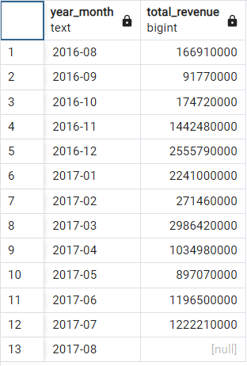
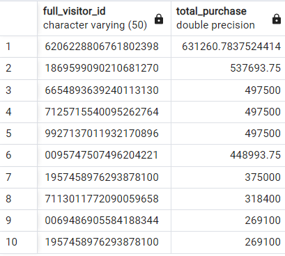
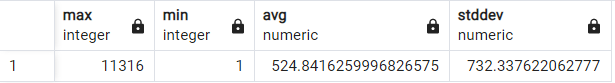
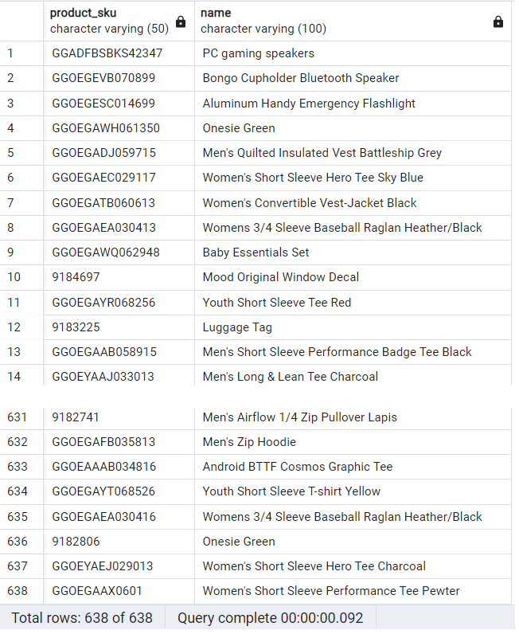

Question 1: How much is the total revenue per each month during period of database?

SQL Queries:
```SQL
-- Q1 - How much is the total revenue per each month during period of database?
select 
      CONCAT(EXTRACT(YEAR  FROM  all_sessions.date),`-`,
		 RIGHT(CONCAT(`0`,EXTRACT(MONTH FROM  all_sessions.date)),2)
		) as Year_Month,
      SUM(total_transaction_revenue) AS Total_Revenue
FROM all_sessions
GROUP BY Year_Month
ORDER BY Year_Month 
```

Answer: 





Question 2: Which 10 full_visitor_id do have the largest purchase amount on the site?

SQL Queries:
```SQL
-- Q2 - Which full_visitor_id had the largest purchase amount on the site?
SELECT  
      full_visitor_id,
	  units_sold*unit_price AS Total_Purchase
FROM     analytics
GROUP BY full_visitor_id,Total_Purchase
ORDER BY Total_Purchase DESC NULLS LAST
```


Answer:




Question 3: How much is maximum, minimum, average, and satndard deviation of spend time on the site?

SQL Queries:
```SQL
-- Q3 - How much is maximum, minimum, average, and satndard deviation of spend time on the site?
SELECT  
     MAX(time_on_site),
	 MIN(time_on_site),
	 AVG(time_on_site),
	 STDDEV(time_on_site)
FROM analytics
```


Answer:



Question 4: Create a list of products that have had never any order?


SQL Queries:
```SQL
-- Q4 - Create a list of products that have had never any order?
SELECT 
      t.product_sku,
	  p.name
FROM
     (SELECT 
	        product_sku 
	  FROM products
      EXCEPT
      SELECT 
	       product_sku 
	  FROM sales_report) AS t
INNER JOIN products AS p
ON (p.product_sku=t.product_sku)
```

Answer:




