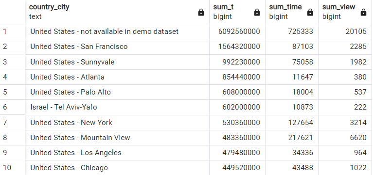

Answer the following questions and provide the SQL queries used to find the answer.

    
**Question 1: Which cities and countries have the highest level of transaction revenues on the site?**


SQL Queries:
```SQL
SELECT 
       country_city,
       SUM(total_transaction_revenue)
FROM  
      (SELECT 
            concat(country,' - ',city) AS country_city, 
            total_transaction_revenue
       FROM all_sessions) AS q1_t1
GROUP BY country_city
ORDER BY SUM DESC NULLS LAST 
```


Answer: The first row of the results is inclued all USA cities with hidden name and maybe more than one city. So it is not reliable. 


**Question 2: What is the average number of products ordered from visitors in each city and country?**


SQL Queries:
```SQL
SELECT 
      country_city,
      AVG(product_quantity)
FROM  
      (SELECT 
            CONCAT(country,' - ',city) AS country_city, product_quantity
       FROM all_sessions) AS q2_t1
GROUP BY country_city
ORDER BY AVG DESC NULLS LAST 
```


Answer: The first row of the results is inclued all USA cities with hidden name and maybe more than one city. So it is not reliable. 


**Question 3: Is there any pattern in the types (product categories) of products ordered from visitors in each city and country?**


SQL Queries:
```SQL
SELECT  
     country_city_cat,
     COUNT(country_city_cat)
FROM 
     (SELECT 
          CONCAT(country,' - ',city,' - ',v2_product_category) AS country_city_cat
      from all_sessions) AS q3_t1
GROUP BY country_city_cat
ORDER BY COUNT DESC
```


Answer: Many of rows of the table inclued all cities with hidden name and maybe more than one city. So it is not reliable. 


**Question 4: What is the top-selling product from each city/country? Can we find any pattern worthy of noting in the products sold?**


SQL Queries:
```SQL
SELECT country_city,
       MAX(count)
FROM

(   SELECT  
          q4_t2.country_city,
    	  q4_t2.name,
    	  COUNT(country_city_sku)
    FROM  
    
        (SELECT 
    	       q4_t1.country_city_sku,
    		   q4_t1.country_city,
    	       (CASE 
    			     WHEN products.name IS NULL THEN
    	                'NO NAME PRODUCT' 
    	       ELSE
    	                products.name
    		 END) 
    	       
         FROM 
       
               (SELECT 
    		          product_sku,
    	              CONCAT(country,' - ',city,' - ',product_sku) AS country_city_sku,
                      CONCAT(country,' - ',city) AS country_city
                FROM 
    			      all_sessions) AS q4_t1
         
         FULL OUTER JOIN 
                    products 
    				on (products.product_sku=q4_t1.product_sku)) AS q4_t2
    
    
    GROUP BY country_city_sku,q4_t2.name,country_city
    ORDER BY COUNT DESC
    ) AS tbl	

GROUP BY country_city
ORDER BY max DESC
```


Answer: Many of rows of the table inclued all cities with hidden name and maybe more than one city. So it is not reliable. 


**Question 5: Can we summarize the impact of revenue generated from each city/country?**

SQL Queries:
```SQL
SELECT 
      country_city,
      SUM(total_transaction_revenue) AS SUM_T,
      SUM(time_on_site) AS SUM_Time,
      SUM(page_views) AS SUM_view
FROM  
      (SELECT 
	      CONCAT(country,' - ',city) AS country_city, 
	      total_transaction_revenue AS total_transaction_revenue,
	      time_on_site,
	      page_views
       FROM all_sessions) AS q1_t1
GROUP BY country_city
ORDER BY SUM_T DESC NULLS LAST 
```


Answer: I was looking for a relationship between total_transaction_revenue, time_on_site, and page_views. So I normalized values and draw all together. But it seems there is no valiable relationship between them.



Graph:


